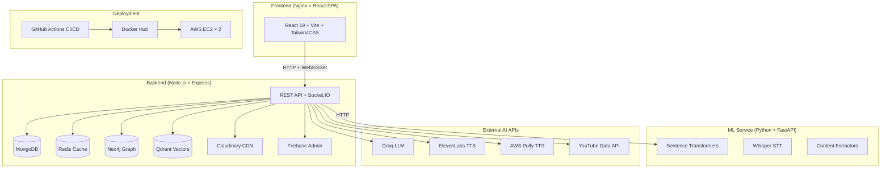

# ETA-OTT v2 — Complete Technology Stack Analysis

> **Project**: Eta Educational Platform (OTT-style learning)
> **Architecture**: 3-service microservices — Frontend, Backend, ML Service

---

## 🖥️ Frontend (`eta-web/`)

| Library | Version | Purpose in Project |
|---|---|---|
| **React** | `^19.2.0` | Core UI framework — powers the entire single-page application |
| **React DOM** | `^19.2.0` | React renderer for the browser DOM |
| **React Router DOM** | `^6.21.1` | Client-side routing — navigates between pages (courses, content, doubts, analytics) |
| **Vite** | `^7.3.1` | Lightning-fast bundler & dev server with HMR; builds the production SPA |
| **@vitejs/plugin-react** | `^5.1.1` | Vite plugin enabling React JSX/Fast Refresh |
| **TailwindCSS** | `^3.4.19` | Utility-first CSS framework — all styling uses Tailwind classes with a custom design system (HSL variables, dark mode) |
| **PostCSS** | `^8.5.6` | CSS transformer required by Tailwind pipeline |
| **Autoprefixer** | `^10.4.24` | Adds vendor prefixes for cross-browser CSS compatibility |
| **Zustand** | `^4.4.7` | Lightweight state management — global stores for auth/user/course state |
| **Axios** | `^1.6.2` | HTTP client for all API calls to the backend |
| **Socket.IO Client** | `^4.6.0` | Real-time WebSocket communication (live doubt chat, notifications) |
| **Firebase** | `^10.7.1` | Client-side Firebase SDK — Google Auth (signup/login), analytics |
| **Framer Motion** | `^10.16.16` | Declarative animations & page transitions throughout the UI |
| **GSAP** | `^3.12.4` | High-performance animations — landing page hero, scroll-triggered effects |
| **Lucide React** | `^0.303.0` | Icon library — all icons in navigation, buttons, cards |
| **React Hot Toast** | `^2.4.1` | Toast notifications for user feedback (success/error messages) |
| **React Markdown** | `^10.1.0` | Renders AI-generated markdown responses in the doubt resolution UI |
| **Remark GFM** | `^4.0.1` | GitHub-Flavored Markdown plugin — tables, task lists, strikethrough in AI answers |
| **React PDF** | `^7.6.0` | In-browser PDF viewer for uploaded course materials |
| **React Player** | `^2.13.0` | Embeds YouTube/video content with playback controls |
| **Recharts** | `^3.7.0` | Charts & data visualization on analytics dashboards |
| **React Force Graph 2D** | `^1.29.1` | Interactive knowledge graph visualization (topics & relationships) |
| **D3 Force** | `^3.0.0` | Physics simulation engine powering the force-directed graph layout |
| **React Intersection Observer** | `^10.0.2` | Lazy-loading & scroll-triggered animations (e.g., content cards appearing on scroll) |
| **QRCode.react** | `^3.2.0` | Generates QR codes for institution/course sharing |
| **HTML5 QRCode** | `^2.3.8` | QR code scanner — students scan to join institutions/courses |
| **ESLint** | `^9.39.1` | Code linting & quality enforcement |
| **eslint-plugin-react-hooks** | `^7.0.1` | Enforces React Hooks best practices |
| **eslint-plugin-react-refresh** | `^0.4.24` | Validates components are compatible with hot refresh |

---

## ⚙️ Backend (`backend/`)

### Core Framework & Server

| Library | Version | Purpose in Project |
|---|---|---|
| **Express** | `^4.18.2` | Web server framework — all REST API routes (`/api/auth`, `/api/courses`, `/api/content`, `/api/doubts`, `/api/ai`, etc.) |
| **Node.js** (runtime) | 22 (Alpine) | JavaScript runtime — runs the backend server |
| **Socket.IO** | `^4.6.0` | WebSocket server for real-time features (live doubt chat, notifications, AI response streaming) |
| **dotenv** | `^16.3.1` | Loads environment variables from `.env` files |

### Security & Middleware

| Library | Version | Purpose in Project |
|---|---|---|
| **Helmet** | `^7.1.0` | Sets security HTTP headers (XSS protection, content-type sniffing, CORS policies) |
| **CORS** | `^2.8.5` | Cross-Origin Resource Sharing — allows frontend to call backend from different origins |
| **Express Rate Limit** | `^7.1.5` | Rate limiting in production — prevents API abuse (100 req / 15 min window) |
| **bcryptjs** | `^2.4.3` | Password hashing for local authentication |
| **jsonwebtoken** | `^9.0.2` | JWT token generation & verification for auth sessions |
| **Morgan** | `^1.10.0` | HTTP request logger for debugging & monitoring |

### Databases

| Library | Version | Purpose in Project |
|---|---|---|
| **Mongoose** | `^8.0.3` | MongoDB ODM — 8 data models: `User`, `Course`, `Content`, `Doubt`, `Institution`, `Branch`, `Notification`, `GeneratedPDF` |
| **Redis** | `^4.6.11` | In-memory caching layer — caches API responses, YouTube search results, reduces DB load |
| **neo4j-driver** | `^5.14.0` | Neo4j graph database driver — stores the **Knowledge Graph** of topics, doubts, and relationships for semantic search |
| **Qdrant** (via Axios REST) | — | Vector database — stores sentence embeddings for semantic similarity search across content, faculty answers, and AI answers |

### File Handling & Media

| Library | Version | Purpose in Project |
|---|---|---|
| **Multer** | `^1.4.5-lts.1` | File upload middleware — handles multipart form-data for PDFs, videos |
| **multer-storage-cloudinary** | `^4.0.0` | Direct file uploads to Cloudinary from multer |
| **Cloudinary** | `^1.41.0` | Cloud media storage — stores uploaded PDFs, videos, images, generated audio |
| **fluent-ffmpeg** | `^2.1.3` | FFmpeg wrapper — video/audio processing (transcoding, extracting audio for Whisper) |
| **@ffmpeg-installer/ffmpeg** | `^1.1.0` | Bundles FFmpeg binary — no system-level install needed |
| **pdf-parse** | `^1.1.4` | Extracts text from PDF files for AI processing |
| **QRCode** | `^1.5.3` | Server-side QR code generation |

### AI & External APIs

| Library | Version | Purpose in Project |
|---|---|---|
| **@aws-sdk/client-polly** | `^3.988.0` | **AWS Polly** — text-to-speech synthesis with Indian accent (Aditi voice), neural engine |
| **Axios** | `^1.6.2` | HTTP client for: Groq API, ElevenLabs API, ML Service calls, Qdrant REST API, YouTube Data API |
| **firebase-admin** | `^12.0.0` | Server-side Firebase — verifies Firebase Auth tokens, admin operations |
| **markdown-it** | `^14.1.1` | Markdown→HTML conversion for AI-generated content |
| **nanoid** | `^5.0.4` | Generates unique IDs (e.g., institution invite codes) |
| **cheerio** | `^1.2.0` | HTML parsing — scrapes web pages for content extraction |
| **puppeteer** | `^24.37.3` | Headless Chrome — generates PDFs from HTML, web scraping |
| **yt-search** | `^2.13.1` | YouTube search fallback when ML service is unavailable |

### Dev Tools

| Library | Version | Purpose in Project |
|---|---|---|
| **Nodemon** | `^3.0.2` | Auto-restarts server on file changes during development |
| **Jest** | `^29.7.0` | Testing framework |

---

## 🤖 AI / ML Service (`ml-service/`)

### Core Framework

| Library | Purpose in Project |
|---|---|
| **FastAPI** | Python web framework — exposes ML endpoints: `/extract`, `/embeddings`, `/search-videos` |
| **Uvicorn** | ASGI server — runs FastAPI in production |
| **Pydantic** | Request/response validation & serialization for all API models |
| **python-dotenv** | Environment variable management |
| **python-multipart** | Handles multipart file uploads to FastAPI |
| **requests** | HTTP client for external API calls |

### Deep Learning & NLP

| Library | Purpose in Project |
|---|---|
| **PyTorch** (`torch`, `torchvision`, `torchaudio`) | Deep learning framework — CPU-only build for inference. Powers Sentence Transformers and Whisper models |
| **Sentence Transformers** | Generates text embeddings using `all-MiniLM-L6-v2` model (~90MB). Used for semantic search, content similarity, and knowledge graph enrichment |
| **Hugging Face Transformers** | NLP model loading infrastructure — tokenizers and model architectures |
| **OpenAI Whisper** | Speech-to-text — transcribes video/audio content for indexing and search |

### Content Extraction

| Library | Purpose in Project |
|---|---|
| **PyMuPDF** (`pymupdf`) | PDF text & metadata extraction — parses uploaded course PDFs |
| **MoviePy** | Video processing — extracts audio tracks from videos for Whisper transcription |
| **yt-dlp** | YouTube video/audio downloader — downloads content for transcription |
| **BeautifulSoup4** | HTML parsing — extracts text from web pages |
| **Playwright** | Headless Chromium browser — renders JavaScript-heavy pages before extraction |
| **html2text** | Converts HTML to clean text for processing |

### Document Generation

| Library | Purpose in Project |
|---|---|
| **FPDF2** | Generates PDF reports/summaries from extracted content |
| **python-docx** | Creates Word documents from processed content |

### Cloud & APIs

| Library | Purpose in Project |
|---|---|
| **Cloudinary** (Python SDK) | Uploads processed media (audio, thumbnails) to Cloudinary |
| **google-api-python-client** | **YouTube Data API v3** — searches YouTube with official API for semantic video recommendations |
| **Pillow** | Image processing — thumbnail generation, image manipulation |

---

## 🚀 Deployment & Containerization

### Docker

| Component | Details |
|---|---|
| **Frontend Dockerfile** | Multi-stage: `node:22-alpine` → `npm run build` → `nginx:alpine` serves static SPA |
| **Backend Dockerfile** | Multi-stage: `node:22-alpine` deps stage → `node:22-alpine` runtime (non-root user `etaapp`) |
| **ML Service Dockerfile** | Single-stage: `python:3.11-slim` + system deps (`ffmpeg`, `libgl1`) + PyTorch CPU + Playwright Chromium (non-root user `etaml`) |
| **docker-compose.app.yml** | Orchestrates frontend + backend on EC2 App Server with bridge network, health checks |
| **docker-compose.ml.yml** | Runs ML service on separate EC2 ML Server with 900MB memory limit (t2.micro optimized) |

### CI/CD

| Tool | Purpose in Project |
|---|---|
| **GitHub Actions** | CI/CD pipeline in `deploy.yml`: builds all 3 Docker images, pushes to Docker Hub, SSH-deploys to 2 EC2 instances |
| **Docker Hub** | Container registry — images: `rmane0069/eta-backend`, `rmane0069/eta-frontend`, `rmane0069/eta-ml-service` |
| **appleboy/ssh-action** | GitHub Action for SSH deployment to EC2 instances |

### Web Server

| Tool | Purpose in Project |
|---|---|
| **Nginx** | Production web server — serves the React SPA, reverse-proxies `/api/` and `/socket.io/` to the backend container, gzip compression, security headers, static asset caching |

### Cloud Infrastructure

| Service | Purpose in Project |
|---|---|
| **AWS EC2** (×2 instances) | EC2 #1: App Server (frontend + backend), EC2 #2: ML Server |
| **AWS Polly** | Text-to-speech API (neural voices, Indian accent) |
| **Qdrant Cloud** | Managed vector database for embedding search |
| **MongoDB Atlas** (implied) | Managed MongoDB database |
| **Redis Cloud** (implied) | Managed Redis cache |
| **Neo4j** (cloud/self-hosted) | Graph database for knowledge graph |
| **Cloudinary** | Media storage CDN |
| **Firebase** | Authentication (Google OAuth), analytics |
| **Netlify** | Previous/alternate frontend hosting (CORS allowlisted) |

---

## 🧠 External AI APIs

| API | Purpose in Project |
|---|---|
| **Groq API** (`llama-3.3-70b-versatile`) | Primary LLM — powers the AI doubt resolution system. Generates context-aware answers using course content, knowledge graph, and visual context |
| **ElevenLabs API** (`eleven_multilingual_v2`) | Human-like text-to-speech — reads AI answers aloud with Hindi/English support. Falls back to AWS Polly on failure |
| **AWS Polly** | Text-to-speech fallback — Indian accent neural voice (Aditi) |
| **YouTube Data API v3** | Official YouTube search for semantic video recommendations |
| **Firebase Auth** | Google OAuth authentication for users |

---

## 📊 Architecture Summary

