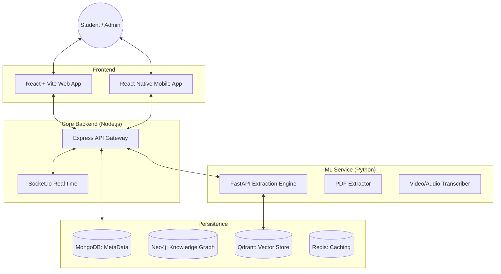
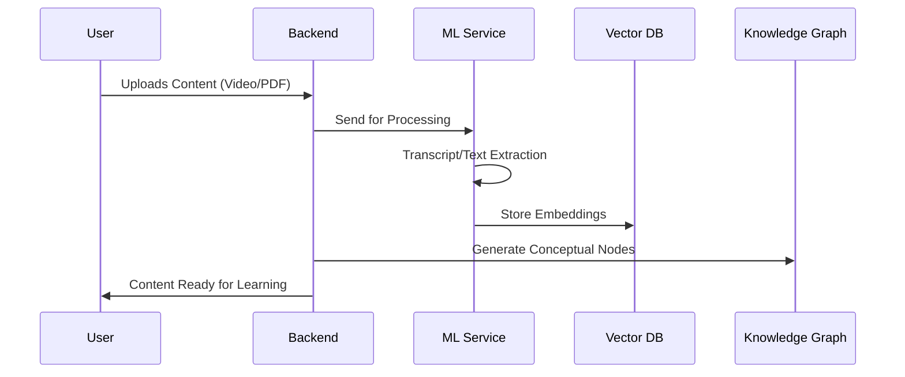
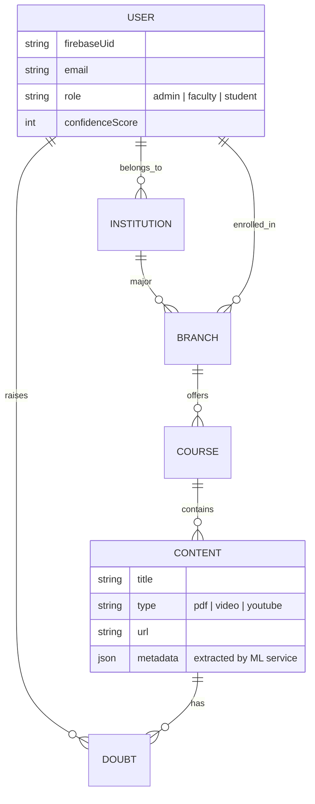

# 🚀 Eta OTT: The Next-Gen AI-Powered Educational Ecosystem

[](https://opensource.org/licenses/ISC)
[](https://reactjs.org/)
[](https://nodejs.org/)
[](https://fastapi.tiangolo.com/)

**Eta OTT** is a revolutionary AI-driven educational platform that transforms static learning material into interactive, intelligent experiences. By integrating advanced machine learning with a seamless OTT (Over-The-Top) streaming interface, Eta provides students with personalized knowledge graphs, AI-powered tutoring, and real-time conceptual analysis.

---

## 🌟 Key Features

- **🧠 Intelligent AI Tutor**: Context-aware AI that answers student queries based specifically on the uploaded course material (PDFs/Videos).
- **🕸️ Knowledge Graph Visualization**: Automatically maps relationships between concepts using Neo4j and D3.js, providing a topological view of learning paths.
- **🎥 Multi-Source Extraction**: Seamlessly extract knowledge from Video files, YouTube links, and PDFs using a dedicated Python ML service.
- **⚡ Real-time Interaction**: Live synchronization and doubt solving powered by Socket.io.
- **📱 Cross-Platform Accessibility**: Fully responsive Web application and native Mobile experience (Beta).
- **🔍 Semantic Search**: Vector-based search utilizing Qdrant for extremely accurate information retrieval.

---

## 🏗️ System Architecture

### High-Level Architecture


### Knowledge Extraction Workflow


---

## 🛠️ Tech Stack

### Frontend & Mobile
- **React 19** with **Vite** for lightning-fast builds.
- **Tailwind CSS** & **Framer Motion** for premium aesthetics and micro-animations.
- **Zustand** for lightweight state management.
- **D3.js & React-Force-Graph** for complex data visualizations.

### Backend & Cloud
- **Node.js & Express** (ESM) for the core API.
- **Socket.io** for real-time bidirectional communication.
- **Firebase Admin** for robust authentication.
- **Cloudinary** for scalable media storage and CDN.
- **AWS Polly** for high-quality Text-to-Speech integration.

### Machine Learning & Data
- **Python / FastAPI** for high-performance extraction endpoints.
- **MongoDB** (Primary metadata store).
- **Neo4j** (Graph database for ontological relationships).
- **Redis** (Session and high-speed cache).
- **Qdrant** (Vector database for AI long-term memory).

---

## 🗺️ Entity Relationship Diagram



---

## 👥 User Roles & Permissions

| Role | Permissions |
| :--- | :--- |
| **Admin** | Manage Institutions, Branches, and Faculty. View site-wide analytics. |
| **Faculty** | Create Courses, Upload Content, Manage Students, and Reply to Doubts. |
| **Student** | Browse Courses, Watch Videos, View Knowledge Graphs, and Ask AI Tutor. |

---

## 📂 Project Structure

```text
📁 Eta OTT
├── 📂 backend         # Node.js Express server with Mongoose & Neo4j
├── 📂 eta-web         # Student & Faculty Portal (React + Tailwind)
├── 📂 eta-mobile      # Cross-platform Mobile App (Expo)
├── 📂 ml-service      # Python FastAPI for Video/PDF Processing
└── 📂 docs            # Documentation & Implementation Logs
```

---

## 🚀 Getting Started

### Prerequisites
- **Node.js**: v18 or late
- **Python**: v3.9+ (with `pip` and `venv`)
- **Databases**:
  - [MongoDB](https://www.mongodb.com/) (Atlas or Local)
  - [Neo4j](https://neo4j.com/) (Aura or Local)
  - [Redis](https://redis.io/) (for caching)
  - [Qdrant](https://qdrant.tech/) (Vector DB - required for AI features)

### 1. ML Service Setup
```bash
cd ml-service
python -m venv venv
# Windows
venv\Scripts\activate 
# Linux/Mac
source venv/bin/activate
pip install -r requirements.txt
python main.py
```

### 2. Backend Setup
```bash
cd backend
npm install
# Create a .env file based on .env.example
npm run dev
```

### 3. Frontend Setup
```bash
cd eta-web
npm install
npm run dev
```

---

## 🛠️ Environment Configuration
Ensure your `.env` files contain the following keys:

**Backend:**
- `MONGODB_URI`, `REDIS_URL`, `NEO4J_URI`, `NEO4J_USER`, `NEO4J_PASSWORD`
- `QDRANT_URL`, `QDRANT_API_KEY`
- `CLOUDINARY_CLOUD_NAME`, `CLOUDINARY_API_KEY`, `CLOUDINARY_API_SECRET`
- `FIREBASE_PROJECT_ID`, `FIREBASE_CLIENT_EMAIL`, `FIREBASE_PRIVATE_KEY`
- `GROQ_API_KEY` (For AI LLM)
- `AWS_ACCESS_KEY_ID`, `AWS_SECRET_ACCESS_KEY` (For Polly TTS)

---

## 💡 How It Works: The AI Pipeline

1. **Ingestion**: A PDF or Video is uploaded to Cloudinary.
2. **Extraction**: The `backend` calls the `ml-service` to process the asset.
3. **NLP Processing**: `ml-service` uses OCR (for PDFs) or Whispering (for Videos) to extract text.
4. **Vectorization**: Extracted text is chunked and stored in **Qdrant** with high-dimensional embeddings.
5. **Graph Logic**: Named entities from the text are used to create or update relationships in **Neo4j**.
6. **Query Phase**: When a student asks a doubt, the backend retrieves relevant context from Qdrant and Neo4j, then feeds it to the **Groq Llama-3** model to generate a precise answer.

---

## 🎨 Design & UX
Eta OTT is built with a focus on **Visual Learning**. 
- **Glassmorphic UI**: Transparent, layered components for a modern feel.
- **Micro-interactions**: Hover effects and transitions powered by `framer-motion`.
- **Responsive Layouts**: Seamless transition between Desktop and Mobile views.

---

## 🛣️ Roadmap
- [ ] **Live Collaboration**: Shared whiteboards for faculty and students.
- [ ] **Gamification**: Badges and progression levels based on confidence scores.
- [ ] **Offline Mode**: Download content for offline viewing on the mobile app.
- [ ] **Multi-language Support**: AI translation for transcripts and documents.

---

## 📄 License
This project is licensed under the **ISC License**.

---
*Developed for the future of education. 🚀*
